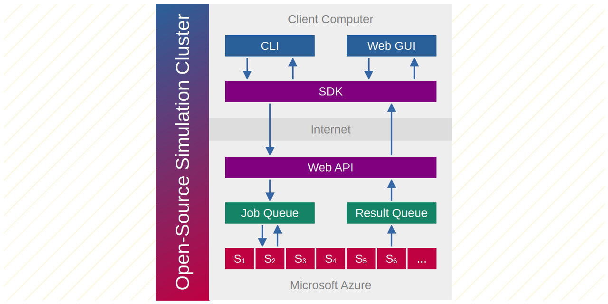

# Open-Source Simulation Cluster

An open-source simulation cluster platform for running finite element analysis (FEA) and computational fluid dynamics (CFD) simulations. The project is based on the following open-source software packages:

* [Code_Aster](https://code-aster.org/) - Finite element analysis
* [OpenFOAM](https://openfoam.org/) - Computational fluid dynamics
* [ParaView](https://www.paraview.org/) - 3D data visualization